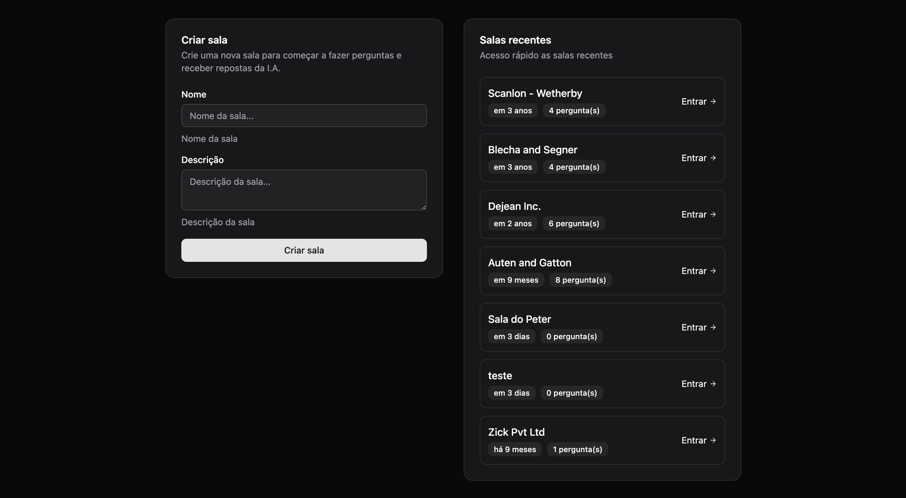
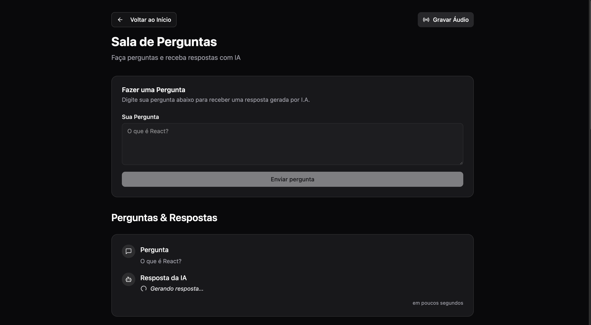

# LetMeAsk AI Agent 🤖💬

Uma aplicação fullstack moderna para criação e gerenciamento de salas de perguntas e respostas com **inteligência artificial integrada**, desenvolvida com as mais recentes tecnologias web.

## 📋 Sobre o Projeto

O **LetMeAsk AI Agent** é uma plataforma inteligente que permite criar salas virtuais onde usuários podem fazer perguntas e obter respostas automáticas geradas por IA. A aplicação utiliza **Google Gemini AI** para transcrever áudios, gerar embeddings e fornecer respostas contextuais baseadas no conteúdo das aulas ou apresentações. Ideal para sessões de Q&A, eventos educacionais, aulas ou qualquer situação que necessite de interação estruturada entre participantes com suporte de IA.

### ✨ Funcionalidades

- 🏠 **Criação de Salas**: Crie salas personalizadas com nome e descrição
- ❓ **Sistema de Perguntas**: Adicione perguntas às salas de forma intuitiva
- 🤖 **IA Integrada**: Respostas automáticas geradas por Google Gemini AI
- 🎤 **Transcrição de Áudio**: Upload e transcrição automática de arquivos de áudio
- 🧠 **Busca Semântica**: Sistema de embeddings para busca contextual
- 📊 **Dashboard**: Visualize todas as salas com informações relevantes
- 🔄 **Atualizações em Tempo Real**: Interface reativa com React Query
- 📱 **Design Responsivo**: Interface moderna e adaptável a diferentes dispositivos

## 🛠️ Tecnologias Utilizadas

### Backend (`/server`)
- **Node.js** - Runtime JavaScript
- **Fastify** - Framework web rápido e eficiente
- **TypeScript** - Tipagem estática
- **Drizzle ORM** - ORM moderno para PostgreSQL
- **PostgreSQL** - Banco de dados relacional com suporte a vetores
- **Google Gemini AI** - IA para transcrição, embeddings e geração de respostas
- **Zod** - Validação de schemas
- **Docker** - Containerização do banco de dados

### Frontend (`/web`)
- **React 19** - Biblioteca para interfaces de usuário
- **TypeScript** - Tipagem estática
- **Vite** - Build tool moderna e rápida
- **React Query (TanStack Query)** - Gerenciamento de estado servidor
- **React Hook Form** - Gerenciamento de formulários
- **React Router DOM** - Roteamento
- **Tailwind CSS** - Framework CSS utilitário
- **Radix UI** - Componentes acessíveis
- **Lucide React** - Ícones modernos
- **Day.js** - Manipulação de datas

## 🚀 Como Executar

### Pré-requisitos
- Node.js (versão 18+)
- Docker e Docker Compose
- PostgreSQL (ou usar o Docker)

### 1. Clone o repositório
```bash
git clone https://github.com/seu-usuario/letmeask-ai-agent.git
cd letmeask-ai-agent
```

### 2. Configure o Backend
```bash
cd server

# Instale as dependências
npm install

# Configure as variáveis de ambiente
cp .env.example .env
# Edite o arquivo .env com suas configurações
# IMPORTANTE: Adicione sua chave da API do Google Gemini em GEMINI_API_KEY

# Inicie o banco de dados com Docker
docker-compose up -d

# Execute as migrações
npm run db:migrate

# (Opcional) Popule o banco com dados de exemplo
npm run db:seed

# Inicie o servidor de desenvolvimento
npm run dev
```

### 3. Configure o Frontend
```bash
cd ../web

# Instale as dependências
npm install

# Inicie o servidor de desenvolvimento
npm run dev
```

### 4. Acesse a aplicação
- **Frontend**: http://localhost:5173
- **Backend**: http://localhost:3333
- **Health Check**: http://localhost:3333/health

## 📁 Estrutura do Projeto

```
letmeask-ai-agent/
├── server/                 # Backend (API)
│   ├── src/
│   │   ├── db/            # Configuração do banco de dados
│   │   │   ├── schema/    # Schemas das tabelas
│   │   │   ├── migrations/# Migrações do banco
│   │   │   └── seed.ts    # Dados de exemplo
│   │   ├── http/          # Rotas da API
│   │   │   └── routes/    # Endpoints organizados
│   │   ├── services/      # Serviços de IA (Gemini)
│   │   ├── env.ts         # Configuração de ambiente
│   │   └── server.ts      # Servidor principal
│   ├── docker-compose.yaml
│   └── package.json
│
├── web/                   # Frontend (React)
│   ├── src/
│   │   ├── components/    # Componentes React
│   │   │   └── ui/        # Componentes de UI reutilizáveis
│   │   ├── http/          # Hooks para API
│   │   ├── pages/         # Páginas da aplicação
│   │   ├── lib/           # Utilitários
│   │   └── main.tsx       # Ponto de entrada
│   └── package.json
│
└── README.md
```

## 🔌 API Endpoints

### Salas (Rooms)
- `GET /rooms` - Lista todas as salas
- `POST /rooms` - Cria uma nova sala

### Perguntas (Questions)
- `GET /rooms/:roomId/questions` - Lista perguntas de uma sala
- `POST /rooms/:roomId/questions` - Cria uma pergunta em uma sala (com resposta automática por IA)

### IA e Áudio
- `POST /rooms/:roomId/upload-audio` - Upload e transcrição de áudio com IA

### Utilitários
- `GET /health` - Status da API

## 🎨 Componentes Principais

### Frontend
- **RoomList**: Lista de salas com informações resumidas
- **CreateRoomForm**: Formulário para criação de salas
- **QuestionForm**: Formulário para adicionar perguntas
- **QuestionItem**: Exibição individual de perguntas

### Hooks Customizados
- **useRooms**: Busca lista de salas
- **useCreateRoom**: Criação de salas com invalidação automática
- **useRoomQuestions**: Busca perguntas de uma sala específica

## 🔄 Gerenciamento de Estado

O projeto utiliza **React Query** para gerenciamento eficiente do estado servidor:

- **Cache inteligente**: Dados são armazenados em cache automaticamente
- **Invalidação automática**: Quando uma sala é criada, a lista é atualizada automaticamente
- **Loading states**: Estados de carregamento gerenciados automaticamente
- **Error handling**: Tratamento de erros integrado

## 🗄️ Banco de Dados

### Schema Principal

**Tabela: rooms**
- `id` (UUID, PK)
- `name` (TEXT, NOT NULL)
- `description` (TEXT, NULLABLE)
- `created_at` (TIMESTAMP)

**Tabela: questions**
- `id` (UUID, PK)
- `room_id` (UUID, FK → rooms.id)
- `question` (TEXT, NOT NULL)
- `answer` (TEXT, NULLABLE)
- `created_at` (TIMESTAMP)

**Tabela: audio_chunks**
- `id` (UUID, PK)
- `room_id` (UUID, FK → rooms.id)
- `transcription` (TEXT, NOT NULL)
- `embeddings` (VECTOR[768], NOT NULL)
- `created_at` (TIMESTAMP)

## 🚀 Deploy

### Backend
Recomendado: Railway, Render ou Heroku
```bash
# Build para produção
npm run build

# Executar em produção
npm start
```

### Frontend
Recomendado: Vercel, Netlify ou Surge
```bash
# Build para produção
npm run build

# Preview local
npm run preview
```

## 🤝 Contribuindo

1. Faça um fork do projeto
2. Crie uma branch para sua feature (`git checkout -b feature/AmazingFeature`)
3. Commit suas mudanças (`git commit -m 'Add some AmazingFeature'`)
4. Push para a branch (`git push origin feature/AmazingFeature`)
5. Abra um Pull Request

## 🤖 Funcionalidades de IA

### Transcrição de Áudio
- Upload de arquivos de áudio (MP3, WAV, etc.)
- Transcrição automática usando Google Gemini AI
- Processamento em português brasileiro

### Sistema de Embeddings
- Geração automática de embeddings para transcrições
- Busca semântica baseada em similaridade vetorial
- Armazenamento eficiente em PostgreSQL com extensão pgvector

### Geração de Respostas
- Respostas automáticas contextuais para perguntas
- Baseadas no conteúdo das transcrições de áudio
- Citação de trechos relevantes do contexto

### Visual
- Importante destacar que este projeto foca na integração e aplicação de inteligência artificial, priorizando funcionalidade ao invés de aspectos visuais elaborados.





## 📄 Licença

Este projeto está sob a licença MIT. Veja o arquivo [LICENSE](LICENSE) para mais detalhes.
Projeto criado juntamente ao NLW Agents (Rocketseat).

## 👨‍💻 Autor

**Peterson Silva**
- GitHub: [@peterpaulodev](https://github.com/peterpaulodev)
- LinkedIn: [Peterson Silva](https://linkedin.com/in/peterson-paulo-marques)

---

⭐ Se este projeto te ajudou, considere dar uma estrela no repositório!
